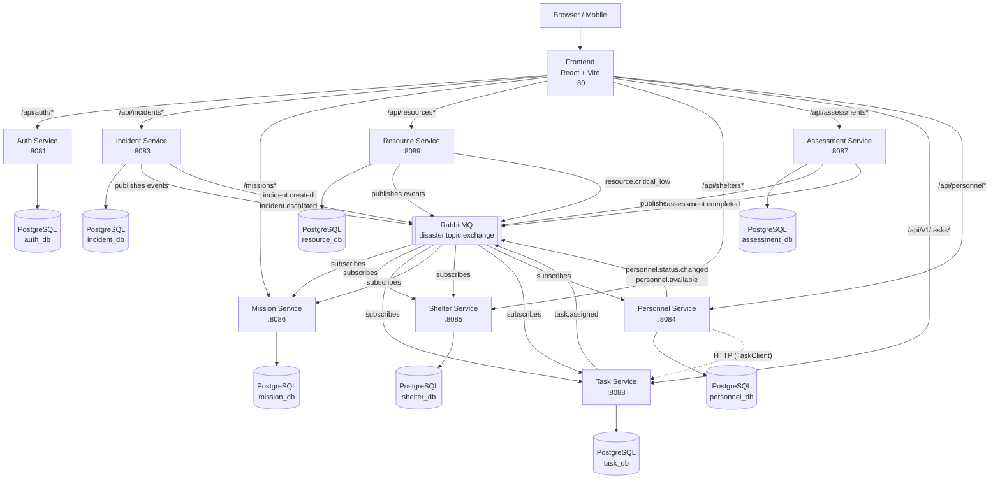
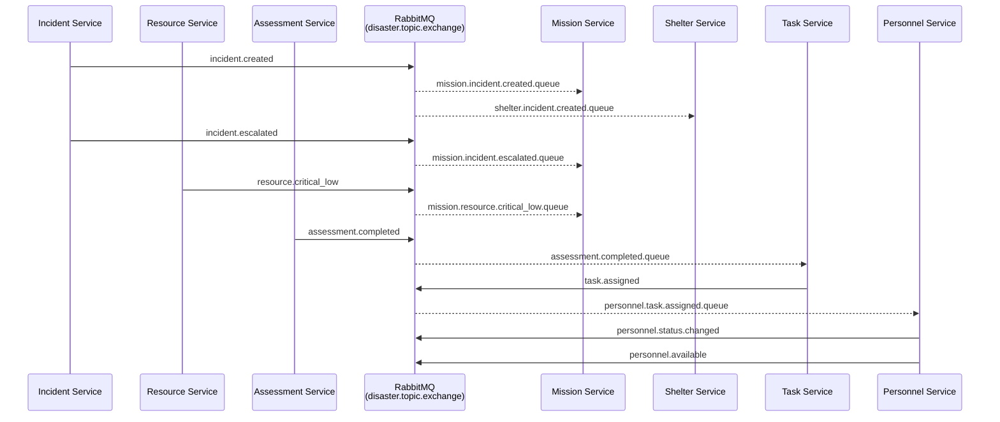

# DISA — Disaster Management System

A microservice-based disaster management platform built with Spring Boot and React. It coordinates incident response, resource allocation, shelter management, damage assessment, and task assignment across multiple response teams.

---

## Table of Contents

- [Architecture](#architecture)
- [Services](#services)
- [Event Flow (RabbitMQ)](#event-flow-rabbitmq)
- [Roles and Use Cases](#roles-and-use-cases)
- [Tech Stack](#tech-stack)
- [Quick Start](#quick-start)

---

## Architecture



Each service has its own PostgreSQL database. The frontend's `docker-compose.yml` spins up a single shared PostgreSQL instance with all databases for full-stack deployment.

---

## Services

| Service | Port | Database | Description |
|---|---|---|---|
| **auth-service** | 8081 | auth_db | User registration, login, JWT token issuing, role management |
| **incident-service** | 8083 | incident_db | Report and track disaster incidents; publishes domain events |
| **mission-service** | 8086 | mission_db | Create and manage response missions triggered by incidents |
| **resource-service** | 8089 | resource_db | Track equipment and supplies; publishes low-stock alerts |
| **shelter-service** | 8085 | shelter_db | Register shelters, manage capacity, handle check-ins |
| **assessment-service** | 8087 | assessment_db | Conduct damage assessments with photo uploads; publishes assessment.completed events |
| **task-service** | 8088 | task_db | Create, assign, and complete response tasks; publishes task.assigned events |
| **personnel-service** | 8084 | personnel_db | Manage responder profiles, skills, and medical records; AI-powered task-to-personnel matching |

### auth-service
Issues JWT tokens that all other services validate. Supports four roles (`ADMIN`, `COORDINATOR`, `RESPONDER`, `VOLUNTEER`). Exposes `/api/auth/register`, `/api/auth/login`, `/api/auth/validate`, and `/api/auth/profile`.

**Key endpoints:** `POST /api/auth/register`, `POST /api/auth/login`, `GET /api/auth/profile`, `GET /api/auth/validate`

### incident-service
The primary event source for the whole system. When an incident is created, it publishes `incident.created` on RabbitMQ so mission-service and shelter-service react automatically. When a severity escalation is triggered via the `/escalate` endpoint, it publishes `incident.escalated` so mission-service can update active missions. Also supports status transitions (REPORTED → ACTIVE → RESOLVED).

**Key endpoints:** `POST /api/incidents`, `GET /api/incidents`, `GET /api/incidents/{id}`, `PUT /api/incidents/{id}`, `PUT /api/incidents/{id}/status?status=`, `PUT /api/incidents/{id}/escalate`, `DELETE /api/incidents/{id}`, `GET /api/incidents/status/{status}`

**Publishes:** `incident.created`, `incident.escalated`

### mission-service
Subscribes to incident and resource events. When a new incident arrives the service logs it so coordinators can create a linked mission. When resources fall critically low, the mission service is notified. Missions track assigned teams, status, and type (`SEARCH_AND_RESCUE`, `EVACUATION`, `MEDICAL_SUPPORT`, `LOGISTICS`, `COMMUNICATION`).

**Key endpoints:** `POST /missions`, `GET /missions`, `GET /missions/{id}`, `PUT /missions/{id}`, `PATCH /missions/{id}/status`, `DELETE /missions/{id}`

**Subscribes to:** `incident.created` → `mission.incident.created.queue`, `incident.escalated` → `mission.incident.escalated.queue`, `resource.critical_low` → `mission.resource.critical_low.queue`

### resource-service
Tracks physical resources (vehicles, medical kits, generators, water supplies, etc.) by type, quantity, and status. Publishes a `resource.critical_low` event when stock falls below a configurable threshold so mission coordinators can be alerted. Supports quantity decrement when resources are consumed during operations.

**Key endpoints:** `POST /api/resources`, `GET /api/resources`, `GET /api/resources/{id}`, `PUT /api/resources/{id}`, `PATCH /api/resources/{id}/decrement`, `DELETE /api/resources/{id}`

**Publishes:** `resource.critical_low`

### shelter-service
Manages temporary shelters. Subscribes to `incident.created` so coordinators know to pre-position shelters near affected areas. Supports capacity tracking with real-time occupancy counts and resident check-in / check-out.

**Key endpoints:** `POST /api/shelters`, `GET /api/shelters`, `GET /api/shelters/{id}`, `PUT /api/shelters/{id}`, `POST /api/shelters/{id}/checkin`, `POST /api/shelters/{id}/checkout`, `DELETE /api/shelters/{id}`

**Subscribes to:** `incident.created` → `shelter.incident.created.queue`

### assessment-service
Field responders submit damage assessments linked to an incident, including photo evidence. Optionally uses the Gemini AI API to assist with damage classification. On completion, publishes an `assessment.completed` event so task-service can auto-generate remediation tasks from the required actions.

**Key endpoints:** `POST /api/assessments` (multipart), `GET /api/assessments`, `GET /api/assessments/{id}`, `GET /api/assessments/incident/{incidentId}`, `PUT /api/assessments/{id}`, `DELETE /api/assessments/{id}`

**Publishes:** `assessment.completed`

### task-service
Granular task tracking (repair a road, set up communications, deliver supplies, etc.). Tasks can be linked to an incident or mission, assigned to a responder by username, and marked complete. Subscribes to `assessment.completed` to auto-create tasks from field assessment actions. When a task is assigned it publishes `task.assigned` so personnel-service can update responder availability.

**Key endpoints:** `POST /api/v1/tasks`, `GET /api/v1/tasks`, `GET /api/v1/tasks/{id}`, `PUT /api/v1/tasks/{id}`, `PATCH /api/v1/tasks/{id}/complete`, `DELETE /api/v1/tasks/{id}`

**Subscribes to:** `assessment.completed` → `assessment.completed.queue`

**Publishes:** `task.assigned`

### personnel-service
Manages the full profile of every disaster-response personnel, covering personal data, skills, and health information. Supports soft-delete (disable without removing records). Uses **Gemini AI** to match pending tasks to the best-suited available responder based on skills, location, and task requirements. Also maintains an HTTP client to call task-service directly for fetching pending tasks.

**Data managed per person:**
- Core profile: name, contact, role, availability status
- Skills: type, proficiency level, certification date (supports bulk create/update/soft-delete)
- Medical record: allergies, chronic conditions, medications, injury history, physical limitations
- Emergency contacts
- Documents (certifications, IDs)

**Key endpoints:**

| Group | Endpoints |
|---|---|
| Person | `GET/POST /api/personnel/person`, `GET/PUT /api/personnel/person/{id}`, `PATCH /api/personnel/person/{id}` (soft-delete), `DELETE /api/personnel/person/{id}` |
| Skills | `GET/POST /api/personnel/skills`, `GET/PUT /api/personnel/skills/{id}`, `PATCH /api/personnel/skills/{id}` (soft-delete), `DELETE /api/personnel/skills/{id}` |
| Assignments | `GET /api/personnel/assignments/available-persons`, `GET /api/personnel/assignments/pending-tasks`, `POST /api/personnel/assignments/match-task`, `POST /api/personnel/assignments/match-all-pending` |
| Medical | `/api/personnel/allergies`, `/api/personnel/chronic-conditions`, `/api/personnel/medications`, `/api/personnel/injuries`, `/api/personnel/physical-limitations` |
| Other | `/api/personnel/emergency-contacts`, `/api/personnel/documents` |

**Subscribes to:** `task.assigned` → `personnel.task.assigned.queue` (updates responder status when assigned to a task)

**Publishes:** `personnel.status.changed`, `personnel.available` (notifies task-service when a responder becomes free)

---

## Event Flow (RabbitMQ)

RabbitMQ decouples services so they can react to each other's events without direct HTTP dependencies. All events flow through the **`disaster.topic.exchange`** (topic type), routed by a dotted routing key to service-specific durable queues. Each receiving service has its own named queue so multiple subscribers independently receive the same event without competing.

### Why RabbitMQ?

| Scenario | What triggers it | Who reacts |
|---|---|---|
| New incident reported | `incident.created` | Mission-service logs it for coordinator action; shelter-service pre-positions nearby shelters |
| Incident severity escalated | `incident.escalated` | Mission-service updates linked active missions |
| Resource stock critically low | `resource.critical_low` | Mission-service alerts coordinators to request resupply |
| Field assessment submitted | `assessment.completed` | Task-service auto-creates remediation tasks from required actions |
| Task assigned to responder | `task.assigned` | Personnel-service updates responder's availability status |
| Responder becomes free | `personnel.available` | Task-service can consider them for new pending tasks |



### Queue reference

| Routing Key | Publisher | Queue | Subscriber |
|---|---|---|---|
| `incident.created` | Incident | `mission.incident.created.queue` | Mission |
| `incident.created` | Incident | `shelter.incident.created.queue` | Shelter |
| `incident.escalated` | Incident | `mission.incident.escalated.queue` | Mission |
| `resource.critical_low` | Resource | `mission.resource.critical_low.queue` | Mission |
| `assessment.completed` | Assessment | `assessment.completed.queue` | Task |
| `task.assigned` | Task | `personnel.task.assigned.queue` | Personnel |
| `personnel.status.changed` | Personnel | `personnel.status.queue` | — (future) |
| `personnel.available` | Personnel | — | — (future) |

---

## Roles and Use Cases

### Role Hierarchy

| Role | Description |
|---|---|
| **ADMIN** | Full system access — manage users, all data |
| **COORDINATOR** | Manage incidents, missions, and resource allocation |
| **RESPONDER** | Execute tasks, submit assessments, check-in shelter residents |
| **VOLUNTEER** | View assigned tasks, basic read access |

### Use Cases by Role

#### ADMIN
- Register and promote users to COORDINATOR or RESPONDER
- View all incidents, missions, resources, shelters, and assessments
- Delete or archive stale records
- Monitor system health via RabbitMQ management UI (`localhost:15672`)

#### COORDINATOR
- **Create an incident** — triggers automatic downstream reaction: mission stub auto-created, shelter pre-positioning notified
- **Open a mission** linked to the incident, set mission type and status
- **Assign tasks** to RESPONDER team members
- **Allocate resources** to missions (vehicles, medical kits, etc.)
- **Register shelters** and set capacity limits
- **Review damage assessments** submitted from the field

#### RESPONDER
- **View assigned tasks** and mark them complete
- **Submit damage assessments** with photos from the field
- **Check residents in/out** of shelters
- **Update resource quantities** (e.g., after consumption or resupply)

#### VOLUNTEER
- **View tasks** that are open or assigned
- **View shelter availability** (nearby shelters with open capacity)
- Basic read access to incidents and assessments

---

## Tech Stack

**Backend**
- Java 21 — Spring Boot 3.x – 4.0.x
- Spring Security (JWT Bearer tokens)
- Spring Data JPA + PostgreSQL
- Spring AMQP (RabbitMQ topic exchange)
- Springdoc OpenAPI / Swagger UI on each service

**Frontend**
- React 19 + TypeScript + Vite
- Zustand (state management)
- Axios (data fetching)
- Tailwind CSS
- Nginx (serves static files + reverse-proxies backend calls)

**Infrastructure**
- Docker + Docker Compose (per-service)
- PostgreSQL 16
- RabbitMQ 3.13 with Management UI

---

## Quick Start

### Prerequisites
- Docker >= 24 and Docker Compose V2

### Deployment Structure

Each service has its own `docker-compose.yml` with its own PostgreSQL database (and RabbitMQ where needed). Services are deployed independently.

```
backend/
  auth-service/docker-compose.yml        ← auth-service + postgres
  incident-service/docker-compose.yml    ← incident-service + postgres + rabbitmq
  mission-service/docker-compose.yml     ← mission-service + postgres + rabbitmq
  resource-service/docker-compose.yml    ← resource-service + postgres + rabbitmq
  shelter-service/docker-compose.yml     ← shelter-service + postgres + rabbitmq
  assessment-service/docker-compose.yml  ← assessment-service + postgres + rabbitmq
  task-service/docker-compose.yml        ← task-service + postgres + rabbitmq
  personnel-service/docker-compose.yml   ← personnel-service + postgres + rabbitmq
frontend/
  docker-compose.yml                     ← all services + shared postgres + frontend
```

### Run a single service (for testing)

All services have sensible defaults — no `.env` file required.

```bash
# Example: start shelter-service standalone
cd backend/shelter-service
docker compose up --build -d

# Check it's healthy
docker compose logs shelter-service --tail=20

# Open Swagger UI
open http://localhost:8085/swagger-ui.html

# Stop when done
docker compose down
```

### Run the full stack (browser testing)

```bash
cd frontend
docker compose up --build -d
```

| URL | What |
|---|---|
| `http://localhost` | Frontend (React app) |
| `http://localhost:8081/swagger-ui.html` | Auth Service Swagger |
| `http://localhost:8083/swagger-ui.html` | Incident Service Swagger |
| `http://localhost:8086/swagger-ui.html` | Mission Service Swagger |
| `http://localhost:8089/swagger-ui.html` | Resource Service Swagger |
| `http://localhost:8085/swagger-ui.html` | Shelter Service Swagger |
| `http://localhost:8087/swagger-ui.html` | Assessment Service Swagger |
| `http://localhost:8088/api/v1/swagger-ui.html` | Task Service Swagger |
| `http://localhost:8084/swagger-ui.html` | Personnel Service Swagger |
| `http://localhost:15672` | RabbitMQ Management (guest/guest) |

### Local development (without Docker)

```bash
# Start just the infrastructure (from any service directory)
docker compose up postgres rabbitmq -d

# Run a service locally
cd backend/incident-service
./mvnw spring-boot:run

# Frontend dev server
cd frontend
npm install
npm run dev   # http://localhost:5173
```

---

## Azure Deployment (per-service)

This guide deploys each microservice as a separate **Azure Container Instance (ACI)** backed by **Azure Database for PostgreSQL** and a shared **RabbitMQ** ACI. Each team member can own and deploy their service independently.

### Prerequisites

```bash
# Install Azure CLI
brew install azure-cli        # macOS
az login
az upgrade

# Set your variables (adjust as needed)
RESOURCE_GROUP=disa-rg
LOCATION=eastus
ACR_NAME=disaregistry           # must be globally unique, lowercase, no hyphens
PG_SERVER=disa-postgres         # Azure PostgreSQL flexible server name
VNET_NAME=disa-vnet
```

### 1. One-time shared infrastructure

```bash
# Create resource group
az group create --name $RESOURCE_GROUP --location $LOCATION

# Create Azure Container Registry
az acr create --resource-group $RESOURCE_GROUP \
  --name $ACR_NAME --sku Basic --admin-enabled true

# Get ACR credentials
ACR_LOGIN_SERVER=$(az acr show --name $ACR_NAME --query loginServer -o tsv)
ACR_PASSWORD=$(az acr credential show --name $ACR_NAME --query passwords[0].value -o tsv)

# Login to ACR
docker login $ACR_LOGIN_SERVER -u $ACR_NAME -p $ACR_PASSWORD
```

### 2. Azure Database for PostgreSQL (shared server, separate databases)

```bash
# Create flexible server (one server, multiple databases)
az postgres flexible-server create \
  --resource-group $RESOURCE_GROUP \
  --name $PG_SERVER \
  --location $LOCATION \
  --admin-user pgadmin \
  --admin-password "Change_Me_123!" \
  --sku-name Standard_B1ms \
  --tier Burstable \
  --public-access 0.0.0.0

# Create one database per service
for DB in auth_db incident_db mission_db resource_db shelter_db assessment_db task_db personnel_db; do
  az postgres flexible-server db create \
    --resource-group $RESOURCE_GROUP \
    --server-name $PG_SERVER \
    --database-name $DB
done

# Note the connection string format:
# jdbc:postgresql://<PG_SERVER>.postgres.database.azure.com:5432/<DB>?sslmode=require
PG_HOST="${PG_SERVER}.postgres.database.azure.com"
```

### 3. RabbitMQ on Azure Container Instances

```bash
az container create \
  --resource-group $RESOURCE_GROUP \
  --name rabbitmq \
  --image rabbitmq:3.13-management \
  --ports 5672 15672 \
  --dns-name-label disa-rabbitmq \
  --environment-variables \
      RABBITMQ_DEFAULT_USER=guest \
      RABBITMQ_DEFAULT_PASS=guest \
  --cpu 1 --memory 1

RABBITMQ_HOST=$(az container show \
  --resource-group $RESOURCE_GROUP --name rabbitmq \
  --query ipAddress.fqdn -o tsv)

echo "RabbitMQ: $RABBITMQ_HOST"
# Management UI: http://$RABBITMQ_HOST:15672 (guest/guest)
```

### 4. Deploy each backend service

Replace `<PG_HOST>`, `<PG_PASSWORD>`, and `<RABBITMQ_HOST>` with your actual values.

#### auth-service

```bash
cd backend/auth-service
docker build -t $ACR_LOGIN_SERVER/auth-service:latest .
docker push $ACR_LOGIN_SERVER/auth-service:latest

az container create \
  --resource-group $RESOURCE_GROUP \
  --name auth-service \
  --image $ACR_LOGIN_SERVER/auth-service:latest \
  --registry-login-server $ACR_LOGIN_SERVER \
  --registry-username $ACR_NAME \
  --registry-password $ACR_PASSWORD \
  --ports 8081 \
  --dns-name-label disa-auth \
  --environment-variables \
      DB_URL="jdbc:postgresql://<PG_HOST>:5432/auth_db?sslmode=require" \
      DB_USERNAME=pgadmin \
      DB_PASSWORD="Change_Me_123!" \
  --cpu 1 --memory 1

AUTH_URL=$(az container show --resource-group $RESOURCE_GROUP --name auth-service --query ipAddress.fqdn -o tsv)
echo "Auth service: http://$AUTH_URL:8081"
```

#### incident-service

```bash
cd backend/incident-service
docker build -t $ACR_LOGIN_SERVER/incident-service:latest .
docker push $ACR_LOGIN_SERVER/incident-service:latest

az container create \
  --resource-group $RESOURCE_GROUP \
  --name incident-service \
  --image $ACR_LOGIN_SERVER/incident-service:latest \
  --registry-login-server $ACR_LOGIN_SERVER \
  --registry-username $ACR_NAME \
  --registry-password $ACR_PASSWORD \
  --ports 8083 \
  --dns-name-label disa-incident \
  --environment-variables \
      DB_URL="jdbc:postgresql://<PG_HOST>:5432/incident_db?sslmode=require" \
      DB_USERNAME=pgadmin \
      DB_PASSWORD="Change_Me_123!" \
      RABBITMQ_HOST="<RABBITMQ_HOST>" \
  --cpu 1 --memory 1
```

#### mission-service

```bash
cd backend/mission-service
docker build -t $ACR_LOGIN_SERVER/mission-service:latest .
docker push $ACR_LOGIN_SERVER/mission-service:latest

az container create \
  --resource-group $RESOURCE_GROUP \
  --name mission-service \
  --image $ACR_LOGIN_SERVER/mission-service:latest \
  --registry-login-server $ACR_LOGIN_SERVER \
  --registry-username $ACR_NAME \
  --registry-password $ACR_PASSWORD \
  --ports 8086 \
  --dns-name-label disa-mission \
  --environment-variables \
      DB_URL="jdbc:postgresql://<PG_HOST>:5432/mission_db?sslmode=require" \
      DB_USERNAME=pgadmin \
      DB_PASSWORD="Change_Me_123!" \
      RABBITMQ_HOST="<RABBITMQ_HOST>" \
  --cpu 1 --memory 1
```

#### resource-service

```bash
cd backend/resource-service
docker build -t $ACR_LOGIN_SERVER/resource-service:latest .
docker push $ACR_LOGIN_SERVER/resource-service:latest

az container create \
  --resource-group $RESOURCE_GROUP \
  --name resource-service \
  --image $ACR_LOGIN_SERVER/resource-service:latest \
  --registry-login-server $ACR_LOGIN_SERVER \
  --registry-username $ACR_NAME \
  --registry-password $ACR_PASSWORD \
  --ports 8089 \
  --dns-name-label disa-resource \
  --environment-variables \
      DB_URL="jdbc:postgresql://<PG_HOST>:5432/resource_db?sslmode=require" \
      DB_USERNAME=pgadmin \
      DB_PASSWORD="Change_Me_123!" \
      RABBITMQ_HOST="<RABBITMQ_HOST>" \
  --cpu 1 --memory 1
```

#### shelter-service

```bash
cd backend/shelter-service
docker build -t $ACR_LOGIN_SERVER/shelter-service:latest .
docker push $ACR_LOGIN_SERVER/shelter-service:latest

az container create \
  --resource-group $RESOURCE_GROUP \
  --name shelter-service \
  --image $ACR_LOGIN_SERVER/shelter-service:latest \
  --registry-login-server $ACR_LOGIN_SERVER \
  --registry-username $ACR_NAME \
  --registry-password $ACR_PASSWORD \
  --ports 8085 \
  --dns-name-label disa-shelter \
  --environment-variables \
      DB_URL="jdbc:postgresql://<PG_HOST>:5432/shelter_db?sslmode=require" \
      DB_USERNAME=pgadmin \
      DB_PASSWORD="Change_Me_123!" \
      RABBITMQ_HOST="<RABBITMQ_HOST>" \
  --cpu 1 --memory 1
```

#### assessment-service

```bash
cd backend/assessment-service
docker build -t $ACR_LOGIN_SERVER/assessment-service:latest .
docker push $ACR_LOGIN_SERVER/assessment-service:latest

az container create \
  --resource-group $RESOURCE_GROUP \
  --name assessment-service \
  --image $ACR_LOGIN_SERVER/assessment-service:latest \
  --registry-login-server $ACR_LOGIN_SERVER \
  --registry-username $ACR_NAME \
  --registry-password $ACR_PASSWORD \
  --ports 8087 \
  --dns-name-label disa-assessment \
  --environment-variables \
      DB_URL="jdbc:postgresql://<PG_HOST>:5432/assessment_db?sslmode=require" \
      DB_USERNAME=pgadmin \
      DB_PASSWORD="Change_Me_123!" \
      RABBITMQ_HOST="<RABBITMQ_HOST>" \
  --cpu 1 --memory 1
```

#### task-service

```bash
cd backend/task-service
docker build -t $ACR_LOGIN_SERVER/task-service:latest .
docker push $ACR_LOGIN_SERVER/task-service:latest

az container create \
  --resource-group $RESOURCE_GROUP \
  --name task-service \
  --image $ACR_LOGIN_SERVER/task-service:latest \
  --registry-login-server $ACR_LOGIN_SERVER \
  --registry-username $ACR_NAME \
  --registry-password $ACR_PASSWORD \
  --ports 8088 \
  --dns-name-label disa-task \
  --environment-variables \
      DB_URL="jdbc:postgresql://<PG_HOST>:5432/task_db?sslmode=require" \
      DB_USERNAME=pgadmin \
      DB_PASSWORD="Change_Me_123!" \
      RABBITMQ_HOST="<RABBITMQ_HOST>" \
  --cpu 1 --memory 1
```

#### personnel-service

```bash
cd backend/personnel-service
docker build -t $ACR_LOGIN_SERVER/personnel-service:latest .
docker push $ACR_LOGIN_SERVER/personnel-service:latest

az container create \
  --resource-group $RESOURCE_GROUP \
  --name personnel-service \
  --image $ACR_LOGIN_SERVER/personnel-service:latest \
  --registry-login-server $ACR_LOGIN_SERVER \
  --registry-username $ACR_NAME \
  --registry-password $ACR_PASSWORD \
  --ports 8084 \
  --dns-name-label disa-personnel \
  --environment-variables \
      DB_URL="jdbc:postgresql://<PG_HOST>:5432/personnel_db?sslmode=require" \
      DB_USERNAME=pgadmin \
      DB_PASSWORD="Change_Me_123!" \
      RABBITMQ_HOST="<RABBITMQ_HOST>" \
  --cpu 1 --memory 1
```

### 5. Deploy the frontend

After deploying all backend services, note each service's FQDN, then deploy the frontend:

```bash
cd frontend
docker build -t $ACR_LOGIN_SERVER/frontend:latest .
docker push $ACR_LOGIN_SERVER/frontend:latest

# Replace <*_URL> with the actual FQDNs from above
az container create \
  --resource-group $RESOURCE_GROUP \
  --name frontend \
  --image $ACR_LOGIN_SERVER/frontend:latest \
  --registry-login-server $ACR_LOGIN_SERVER \
  --registry-username $ACR_NAME \
  --registry-password $ACR_PASSWORD \
  --ports 80 \
  --dns-name-label disa-frontend \
  --environment-variables \
      AUTH_SERVICE_URL="http://<AUTH_FQDN>:8081" \
      INCIDENT_SERVICE_URL="http://<INCIDENT_FQDN>:8083" \
      MISSION_SERVICE_URL="http://<MISSION_FQDN>:8086" \
      RESOURCE_SERVICE_URL="http://<RESOURCE_FQDN>:8089" \
      SHELTER_SERVICE_URL="http://<SHELTER_FQDN>:8085" \
      ASSESSMENT_SERVICE_URL="http://<ASSESSMENT_FQDN>:8087" \
      TASK_SERVICE_URL="http://<TASK_FQDN>:8088" \
  --cpu 1 --memory 1

FRONTEND_URL=$(az container show --resource-group $RESOURCE_GROUP --name frontend --query ipAddress.fqdn -o tsv)
echo "App: http://$FRONTEND_URL"
```

### Service environment variables reference

| Service | `DB_URL` database | RabbitMQ role |
|---|---|---|
| auth-service | `auth_db` | None |
| incident-service | `incident_db` | Publisher (`incident.created`, `incident.escalated`) |
| mission-service | `mission_db` | Subscriber (`incident.created`, `incident.escalated`, `resource.critical_low`) |
| resource-service | `resource_db` | Publisher (`resource.critical_low`) |
| shelter-service | `shelter_db` | Subscriber (`incident.created`) |
| assessment-service | `assessment_db` | Publisher (`assessment.completed`) |
| task-service | `task_db` | Subscriber (`assessment.completed`) + Publisher (`task.assigned`) |
| personnel-service | `personnel_db` | Subscriber (`task.assigned`) + Publisher (`personnel.status.changed`, `personnel.available`) |

All services accept these environment variables (with defaults shown):

```
DB_URL=jdbc:postgresql://localhost:5432/<db_name>
DB_USERNAME=postgres
DB_PASSWORD=postgres
RABBITMQ_HOST=localhost
RABBITMQ_PORT=5672
RABBITMQ_USERNAME=guest
RABBITMQ_PASSWORD=guest
```
