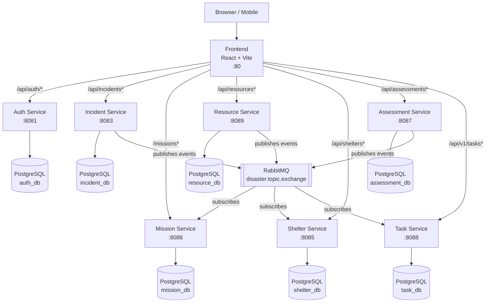
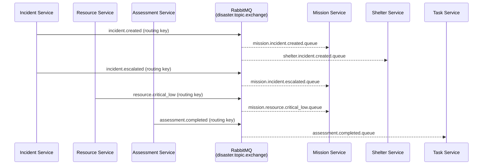

# DISA — Disaster Management System

A microservice-based disaster management platform built with Spring Boot and React. It coordinates incident response, resource allocation, shelter management, damage assessment, and task assignment across multiple response teams.

---

## Table of Contents

- [Architecture](#architecture)
- [Services](#services)
- [Event Flow (RabbitMQ)](#event-flow-rabbitmq)
- [Roles and Use Cases](#roles-and-use-cases)
- [Tech Stack](#tech-stack)
- [Quick Start](#quick-start)

---

## Architecture



Each service has its own PostgreSQL database. The frontend's `docker-compose.yml` spins up a single shared PostgreSQL instance with all databases for full-stack deployment.

---

## Services

| Service | Port | Database | Description |
|---|---|---|---|
| **auth-service** | 8081 | auth_db | User registration, login, JWT token issuing, role management |
| **incident-service** | 8083 | incident_db | Report and track disaster incidents; publishes domain events |
| **mission-service** | 8086 | mission_db | Create and manage response missions triggered by incidents |
| **resource-service** | 8089 | resource_db | Track equipment and supplies; publishes low-stock alerts |
| **shelter-service** | 8085 | shelter_db | Register shelters, manage capacity, handle check-ins |
| **assessment-service** | 8087 | assessment_db | Conduct damage assessments with photo uploads; publishes assessment.completed events |
| **task-service** | 8088 | task_db | Create, assign, and complete response tasks |
| **personnel-service** | 8084 | personnel_service | Manage responder profiles with skills and medical data; AI-powered task matching |

### auth-service
Issues JWT tokens that all other services validate. Supports four roles (`ADMIN`, `COORDINATOR`, `RESPONDER`, `VOLUNTEER`). Exposes `/api/auth/register`, `/api/auth/login`, `/api/auth/validate`, and `/api/auth/profile`.

### incident-service
The primary event source. When an incident is created or its severity escalates, it publishes a RabbitMQ event that downstream services react to automatically.

### mission-service
Subscribes to incident and resource events. When a new incident arrives, a coordinator can create a mission linked to it. Missions track assigned teams, status, and type (SEARCH_AND_RESCUE, EVACUATION, MEDICAL_SUPPORT, etc.).

### resource-service
Tracks physical resources (vehicles, medical kits, generators, etc.) by type, quantity, and status. Publishes a `resource.critical_low` event when stock falls below a threshold so mission coordinators can be alerted.

### shelter-service
Manages temporary shelters. Subscribes to `incident.created` events so new shelters can be pre-positioned. Supports capacity tracking and resident check-in / check-out.

### assessment-service
Field responders submit damage assessments with photos. Optionally uses the Gemini API to assist with damage classification. On completion, publishes an `assessment.completed` event so task-service can auto-generate tasks from required actions.

### task-service
Granular task tracking (repair a road, set up comms, etc.). Tasks can be assigned to a responder by username and marked complete.

---

## Event Flow (RabbitMQ)

All events are published to the `disaster.topic.exchange` topic exchange and routed to service-specific queues to avoid competing consumers.



**Each service has its own named queue** to avoid competing consumers. Mission and shelter services independently receive `incident.created`; task-service receives `assessment.completed` to auto-generate tasks.

---

## Roles and Use Cases

### Role Hierarchy

| Role | Description |
|---|---|
| **ADMIN** | Full system access — manage users, all data |
| **COORDINATOR** | Manage incidents, missions, and resource allocation |
| **RESPONDER** | Execute tasks, submit assessments, check-in shelter residents |
| **VOLUNTEER** | View assigned tasks, basic read access |

### Use Cases by Role

#### ADMIN
- Register and promote users to COORDINATOR or RESPONDER
- View all incidents, missions, resources, shelters, and assessments
- Delete or archive stale records
- Monitor system health via RabbitMQ management UI (`localhost:15672`)

#### COORDINATOR
- **Create an incident** — triggers automatic downstream reaction: mission stub auto-created, shelter pre-positioning notified
- **Open a mission** linked to the incident, set mission type and status
- **Assign tasks** to RESPONDER team members
- **Allocate resources** to missions (vehicles, medical kits, etc.)
- **Register shelters** and set capacity limits
- **Review damage assessments** submitted from the field

#### RESPONDER
- **View assigned tasks** and mark them complete
- **Submit damage assessments** with photos from the field
- **Check residents in/out** of shelters
- **Update resource quantities** (e.g., after consumption or resupply)

#### VOLUNTEER
- **View tasks** that are open or assigned
- **View shelter availability** (nearby shelters with open capacity)
- Basic read access to incidents and assessments

---

## Tech Stack

**Backend**
- Java 21 — Spring Boot 3.x – 4.0.x
- Spring Security (JWT Bearer tokens)
- Spring Data JPA + PostgreSQL
- Spring AMQP (RabbitMQ topic exchange)
- Springdoc OpenAPI / Swagger UI on each service

**Frontend**
- React 19 + TypeScript + Vite
- Zustand (state management)
- Axios (data fetching)
- Tailwind CSS
- Nginx (serves static files + reverse-proxies backend calls)

**Infrastructure**
- Docker + Docker Compose (per-service)
- PostgreSQL 16
- RabbitMQ 3.13 with Management UI

---

## Quick Start

### Prerequisites
- Docker >= 24 and Docker Compose V2

### Deployment Structure

Each service has its own `docker-compose.yml` with its own PostgreSQL database (and RabbitMQ where needed). Services are deployed independently.

```
backend/
  auth-service/docker-compose.yml        ← auth-service + postgres
  incident-service/docker-compose.yml    ← incident-service + postgres + rabbitmq
  mission-service/docker-compose.yml     ← mission-service + postgres + rabbitmq
  resource-service/docker-compose.yml    ← resource-service + postgres + rabbitmq
  shelter-service/docker-compose.yml     ← shelter-service + postgres + rabbitmq
  assessment-service/docker-compose.yml  ← assessment-service + postgres + rabbitmq
  task-service/docker-compose.yml        ← task-service + postgres + rabbitmq
  personnel-service/docker-compose.yml   ← personnel-service + postgres + rabbitmq
frontend/
  docker-compose.yml                     ← all services + shared postgres + frontend
```

### Run a single service (for testing)

All services have sensible defaults — no `.env` file required.

```bash
# Example: start shelter-service standalone
cd backend/shelter-service
docker compose up --build -d

# Check it's healthy
docker compose logs shelter-service --tail=20

# Open Swagger UI
open http://localhost:8085/swagger-ui.html

# Stop when done
docker compose down
```

### Run the full stack (browser testing)

```bash
cd frontend
docker compose up --build -d
```

| URL | What |
|---|---|
| `http://localhost` | Frontend (React app) |
| `http://localhost:8081/swagger-ui.html` | Auth Service Swagger |
| `http://localhost:8083/swagger-ui.html` | Incident Service Swagger |
| `http://localhost:8086/swagger-ui.html` | Mission Service Swagger |
| `http://localhost:8089/swagger-ui.html` | Resource Service Swagger |
| `http://localhost:8085/swagger-ui.html` | Shelter Service Swagger |
| `http://localhost:8087/swagger-ui.html` | Assessment Service Swagger |
| `http://localhost:8088/api/v1/swagger-ui.html` | Task Service Swagger |
| `http://localhost:8084/swagger-ui.html` | Personnel Service Swagger |
| `http://localhost:15672` | RabbitMQ Management (guest/guest) |

### Local development (without Docker)

```bash
# Start just the infrastructure (from any service directory)
docker compose up postgres rabbitmq -d

# Run a service locally
cd backend/incident-service
./mvnw spring-boot:run

# Frontend dev server
cd frontend
pnpm install
pnpm dev   # http://localhost:5173
```
